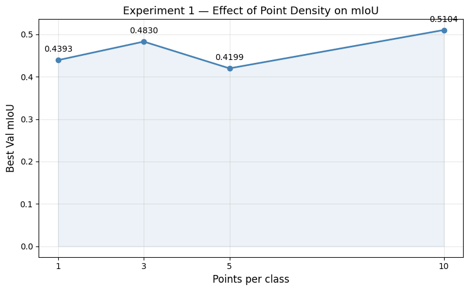
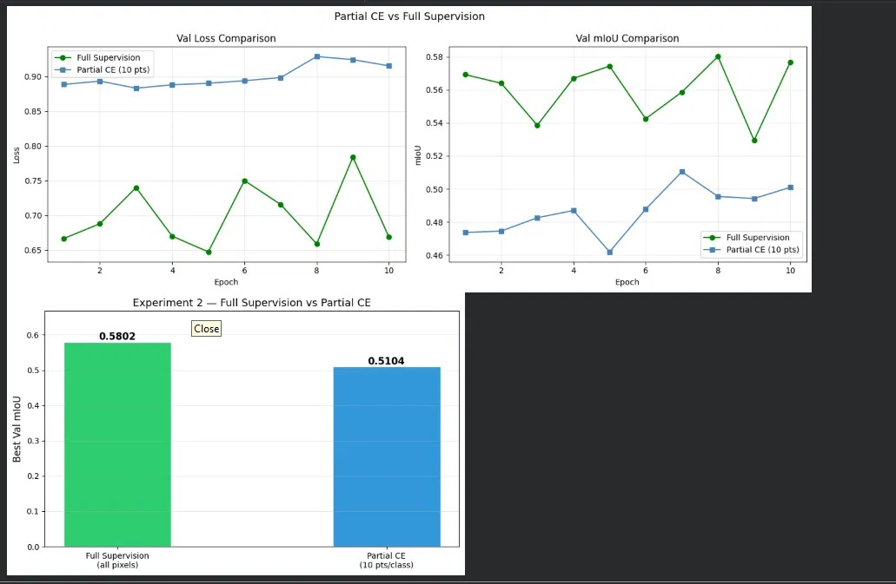
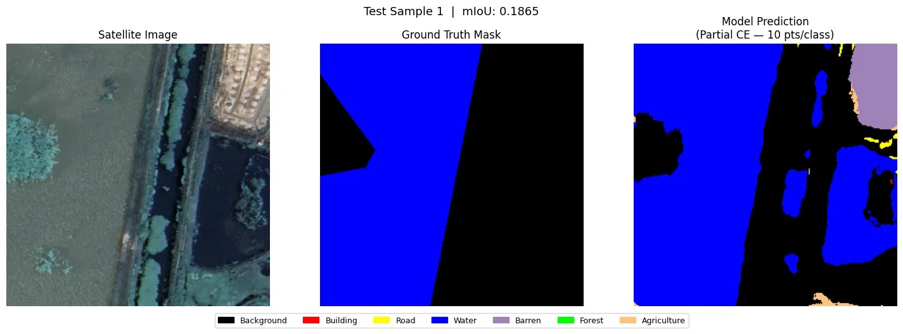
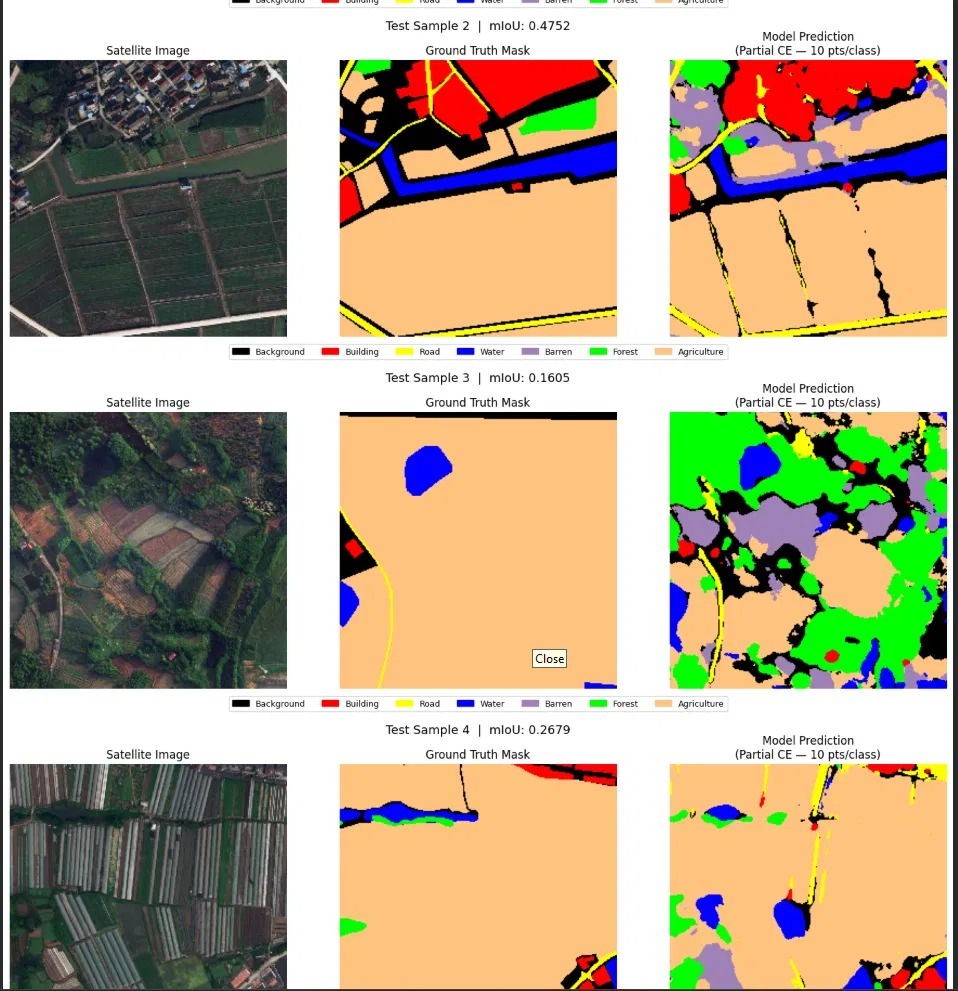

## Partial Cross Entropy Loss for Weakly Supervised Remote Sensing Segmentation

## Introduction

** Semantic Segmentation** is task used to assign class label to every single pixel in an image, in remote sensing, this means classifying each pixel os a satellite image as one 
of several land types (water, agriculture, road, ect). It is an intensive annotation task because training models are manuallu outlined for every region in the image. 

The standard approach for this task reauires dense masks, where every pixel in the image carries a label, therefore a 1024 X 1024 satellite image has over 1 million labels per image, collecting this amount
of annotation at scale is expensive and time consuming, also prone to errors, lastly very impractical to organisation working with large geographhic datasets. 

Using Sparse Point Labels to train Semantic Segementation
Our script explores an alternative method of completing tis annotation task, train our model using sparse point labels, where a humman annotator provides a small number of points from the pixels. 
How much can our model learn to segment an entire image from a handful of labelled pixels,
How much performance is lost compared to full dense supervision


## Dataset

Using the  [**LoveDA**](https://www.kaggle.com/datasets/growinfame/loveda) dataset, publicly available remote sensing benchmark containing aerial images of both urban and rural scenes in China
Each image is 1024x1024 pixels and coms with a full pixel-level annotation mask covering seven land cover classes. 

| Class Index | Class Name
| ------ | ------
| 0 |  Background 
| 1 | Building
| 2 |  Road
| 3 |  Water
| 4 |  Barren
| 5 | Forest
| 6 |  Agriculture

The dataset contains 4,191 image-mask pairs in total. We split these into training (70%), validation (15%), and test (15%) sets using a 42 random seed for reproducibility.
One important data preprocessing step was remapping the original mask values. LoveDA stores class indices starting from 1 (values 1 to 7), but PyTorch's cross-entropy loss expects indices starting from 0. I applied a simple shift during loading:

| Split | Count |
|---|---|
| Train | 2,933 |
| Validation | 628 |
| Test | 630 |

``` mask = np.clip(mask - 1, 0, 6).astype(np.uint8) ```

## Method

### Simulating Point Labels

The LoveDA dataset provides full dense masks, but my goal is to simulate a weakly-supervised scenario. I created a helper function called **simulate_point_labels** that takes a full mask and randomly samples N pixels per class, returning a binary point mask of the same spatial size. The point mask contains 1 at labeled pixel locations and 0 everywhere else.

```
def simulate_point_labels(mask, num_points_per_class=5):
    point_mask = np.zeros_like(mask)
    classes = np.unique(mask)
    for cls in classes:
        rows, cols = np.where(mask == cls)
        n_sample = min(num_points_per_class, len(rows))
        chosen = np.random.choice(len(rows), size=n_sample, replace=False)
        point_mask[rows[chosen], cols[chosen]] = 1
    return point_mask
```
## Partial Cross-Entropy Loss

The standard cross-entropy loss computes a prediction error at every pixel and averages over the entire image. This works well when we have full dense masks but becomes problematic with sparse labels, because pixels with no annotation would contribute meaningless gradients to the training process.

Partial Cross-Entropy solves this by masking out unlabeled pixels before computing the loss. The formula is:


Here, we set all the unlabeled pixels position to ```ignore_index = -1``` before passing the target to ```F.cross_entrop``` PyTorch skips positions with the ignore index entirely so no gradient flows
from those pixels. 
```
    def partial_cross_entropy_loss(predictions, masks, point_masks, ignore_index=-1):
        sparse_gt = masks.clone().long()
        sparse_gt[point_masks == 0] = ignore_index
        return F.cross_entropy(
            predictions,
            sparse_gt,
            ignore_index=ignore_index,
            reduction="mean"
        )
    
```
| Loss Function | Pixels Used | Coverage
| ------ | ------ | ------
| Standard Cross Entropy |  65,536 | 100% 
| Partial CE (1 pts/class) | ~6 | 0.0092%
| Partial CE (3 pts/class) | ~18 | 0.0275%
| Partial CE (5 pts/class) | ~30 | 0.0458%
| Partial CE (10 pts/class) | ~60 | 0.0916%

## Model Architecture

I used the 4-level UNet with skip connections as the segmentation model, UNet was chosen because of its performance with segementation task with sparse data and its skip connection provides a way to preserve
spatial detail during decoding. 
The encode progressively downsamples the input from 256x256 to 16x16 while learning increasing abstract features, the decoder then upsamples back to the original resolution, adding features from the encoder at each level
through skip connections. 

The model has 6,857,319 trainable parameters, All parameters are updated during training but gradients flow only from the labeled pixels identified by the point mask

## Training Config:

| Parameter | Value 
| ------ | ------
| Optimiser |  Adam
| Learning Rate | 0.0001
| Epochs |  10
| Batch size |  8
| Image Size |  256x256
| Evaluation Metric |  Mean IoU (mIoU)

Evaluation was always performed against the full ground truth mask, not the sparse point mask. The model was trained on partial labels but evaluation was applied on complete ground truth, which gives an honest overview of how well it learned to segment the whole image.


## Experiments
I designed two experiments to explore factors that affect the perfomance of Partical Cross Entropy training.

## Experiment 1:
- Goal: Understand how the number of labeled points per class affects segmentation quality
- Hypothesis: More labeled points per class should give the model more signal to learn from, resthis should return a higher mean IoU. I expect an incraing trend with diminishing return at higher densities.
- Setup: Train the UNet model on number of points variable with point densities as 1,3,5,10. All other parameters were assigned to constant value
- Results:
  
    | Point Per Class | Validation mIoU
    | ------ | ------
    | 1 |  0.4393
    | 3 | 0.4830
    | 5 |  0.4199
    | 10 |  0.5104

  **Validation mIoU across point per class**
  

  The results confirms our hypothesis, increasing points in each class improves mIoU from 0.44 to 0.51,the 10 point configuration perofms best.
  The anomalu in point 5 compared to 3 point with mIoU 0.48 indicates a high variance inherent in sparse label training. It shows that specific pixels that happen to be sampled have stronger influence on what model learns   in each epoch.

  *A key insight from this experiment shows that a single point in a class produces a model that achieves over 43% mIoU, indicating that Partial CE can extract meanignful signal from extremely limited annotations.*


## Experiment 2:
- Goal: Measure how much performance is lost by using sparse point labels instead of a complete dense annotation.
- Hypothesis: Full supervision will outperfomr Partial CE because it recieves more gradient signal from every pixel. Teh gap between the two will help us quantify the cost of sparse annotation.
- Setup: I trained a the UNet model using standard Cross Entropy loss on all pixels and compared it against the best performing Partial CE configuration from our Experiement 1. Both models use the same architecture,
  optimiser. learning rate and number of epochs, point mask argument was ignored for loss function in the full supervision model.
- Results:
  
| Condition | Best Validation mIoU
| ------ | ------ | -------
| Full Supervion (all pixels) |  0.5802
| Partial CE (10pts/class) | 0.5104
| Gap | 0.0698
| Partial CE recovery |  88.0%
  
  **Visualise Experiment 2**
  
  


Full supervison achieves the best validation mIoU of 0.5802 while Partial CE achieves 0.5104, with a gap of 0.0698, this implies that Partial CE recovers 88% of the performance are achieveable with complete dense annotation, while using only 60 labeled pixels per image instead of 65536 (the number of pixels in 256x256 image).

The loss curves in our plot indicates another interesting pattern, the full supervision of the model shows higher variance across epochs, with validation loss jumping noticably between 2 and 9 epochs. Partial CE
produces a much smoother and more stable loss trajectory, this is due to gradients in full supervison are computed from every pixel including ambiguous boundary regions which can introduce noise while Partial CE
computes its gradients only from a small set therefore not exposed to the noise.

Both models show healthy training behaviour with no sign of overfitting: validation loss stays close to training loss throughout, and mIoU improves consistently.


## Qualitative Results

I used the best Partial CE model on our test data, to see how it would be handling unseen data and ran inference on inages to visually inspect the quality of model prediction.
- **For Test Sample 1**
  
 
  Its mIoU is 0.1865, the ground truth contains only water and background , the model correctly identifies the water body but incorrectly predicts Barren, Road and Agriculture in
  areas that the ground truth masks as Background.
  
- **For Test Sample 2-4**


Test Sample 2 (mIoU: 0.4752): The model correctly identifies the large agriculture region (orange), the water channel (blue), road boundaries (yellow), and building clusters (red). This is the strongest of the four     test samples.

The qualitative results reveal a consistent pattern. The model performs well in areas containing multiple visually distinct classes, where each land cover type has a clear and different appearance. Test Sample 2 demonstrates this: water, roads, buildings, and farmland look visually different from each other, and the model's sparse training points were sufficient to learn these distinctions.

The model struggles on scenes where a single dominant class covers most of the image and contains internal visual diversity.
For **Test Sample 3 (mIoU: 0.1605)** and **Test Sample 4 (mIoU: 0.2679)**, the ground truth is predominantly Agriculture. However, agricultural fields contain many different crop types, growth stages, greenhouse structures, and shadows, which look visually distinct from each other. With only 10 labeled points in the Agriculture region, the model sees only a fraction of this visual diversity and misclassifies many Agriculture sub-regions as Forest, Barren, or Road.
A human labeller clicking 10 points in a large agricultural scene will naturally click on only a small sample of the visual variation present. The model therefore cannot learn that all of those variations belong to the same class without seeing more of them.

## Summary

| | Value |
|---|---|
| Total images | 4,191 |
| Image size (training) | 256x256 |
| Model | UNet (6.8M parameters) |
| Loss function | Partial Cross-Entropy |
| Best point density | 10 pts/class |
| Best Partial CE mIoU | 0.5104 |
| Full supervision mIoU | 0.5802 |
| Performance recovery | 88.0% |
| Label coverage (10 pts) | 0.006% of pixels |

Partial Cross-Entropy is an effective approach to weakly-supervised segmentation. By computing the loss only over labeled pixels and ignoring everything else, the model learns meaningful segmentation patterns from a tiny fraction of the available annotation. Using 10 labeled points per class, approximately 60 pixels per image, the model recovers 88% of the performance achievable with full dense annotation.
 
The primary failure mode is visually uniform scenes dominated by a single class with high intra-class variation. Future work could address this through class-balanced sampling strategies that select points covering more of the visual diversity within each class, or through semi-supervised methods that use unlabeled pixels to regularise the model's predictions.
      
  
            


